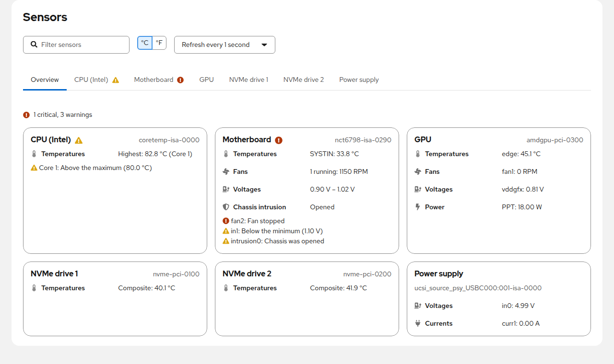
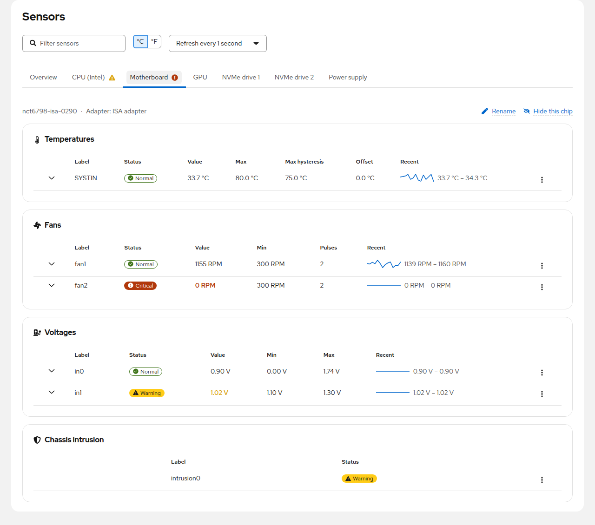
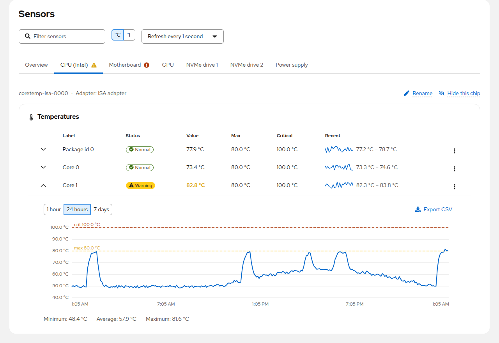

# Cockpit Sensors

A [Cockpit](https://cockpit-project.org/) module that displays all hardware sensor data
reported by [lm-sensors](https://github.com/lm-sensors/lm-sensors): temperatures, fan speeds, voltages,
power, currents, energy, humidity and chassis intrusion. It tells you which sensors need attention,
and keeps their history with [Performance Co-Pilot (PCP)](https://pcp.io/).



# Features

- **Overview** of all sensor chips at a glance: hottest temperature, running fans, power draw
  and the sensors that need attention
- One tab per sensor chip, named after its driver (CPU, GPU, NVMe drive, Motherboard, ...),
  grouped into temperatures, fans, voltages, power, currents, energy, humidity and chassis intrusion
- **Alerts**: a status for every sensor (Normal, Warning, Critical) from its limits and the alarm flags of
  the chip, with the reason and the exceeded limit; tabs and Cockpit's menu show when a sensor is in
  trouble, and alerts of a sensor can be ignored (see [Alerts](#alerts))
- Live readings with a sparkline of the last readings and the lowest/highest value since the page
  was opened; refresh every 1, 2, 5 or 10 seconds, paused while the page is not visible
- Filter sensors by name; rename or hide sensors and whole chips (remembered in the browser)
- Sensor history: expand any sensor to see its chart for the last hour, 24 hours or 7 days,
  recorded with [Performance Co-Pilot (PCP)](https://pcp.io/), and export it as CSV
  (see [Sensor history](#sensor-history))
- Celsius or Fahrenheit (applies to all temperature limits; the choice is remembered)
- Works with older lm-sensors versions without JSON output (`sensors -u` fallback)
- Offers to install and configure lm-sensors when it is missing
  (Debian/Ubuntu, Fedora/RHEL/CentOS, openSUSE, Arch, Alpine), and to detect sensors when none is found
- Follows the Cockpit look, including dark mode

# Installation

Packages for every release are attached to the
[latest release](https://github.com/ocristopfer/cockpit-sensors/releases/latest).
They need Cockpit and depend on `lm-sensors`. If the page shows no sensors, click **Detect sensors**
(or run `sudo sensors-detect` once).

## Debian / Ubuntu (and derivatives)

From the [APT repository](https://ocristopfer.github.io/cockpit-sensors/), which also delivers updates through `apt upgrade`:

```shell
sudo install -d -m 0755 /etc/apt/keyrings
curl -fsSL https://ocristopfer.github.io/cockpit-sensors/key.gpg | sudo gpg --dearmor -o /etc/apt/keyrings/cockpit-sensors.gpg
echo "deb [signed-by=/etc/apt/keyrings/cockpit-sensors.gpg] https://ocristopfer.github.io/cockpit-sensors stable main" | sudo tee /etc/apt/sources.list.d/cockpit-sensors.list
sudo apt update
sudo apt install cockpit-sensors
```

The repository is signed with the key `4DB9B57CDC03DBE1CD5E7CCD69E7F89677144C1B`.

Or install the package from the release directly:

```shell
wget https://github.com/ocristopfer/cockpit-sensors/releases/latest/download/cockpit-sensors.deb
sudo apt install ./cockpit-sensors.deb
```

## Fedora / RHEL / CentOS Stream

From the [COPR repository](https://copr.fedorainfracloud.org/coprs/ocristopfer/cockpit-sensors/) (x86_64 and aarch64), which also delivers updates:

```shell
sudo dnf copr enable ocristopfer/cockpit-sensors
sudo dnf install cockpit-sensors
```

Or install the RPM from the release directly:

```shell
sudo dnf install https://github.com/ocristopfer/cockpit-sensors/releases/latest/download/cockpit-sensors.noarch.rpm
```

## Any other distribution (manual install)

```shell
wget https://github.com/ocristopfer/cockpit-sensors/releases/latest/download/cockpit-sensors.tar.xz
tar -xf cockpit-sensors.tar.xz cockpit-sensors/dist
sudo rm -rf /usr/share/cockpit/sensors
sudo mkdir -p /usr/share/cockpit/sensors
sudo cp -r cockpit-sensors/dist/. /usr/share/cockpit/sensors/
rm -r cockpit-sensors cockpit-sensors.tar.xz
```

Then reload Cockpit and open **Sensors** in the menu.

# Alerts



Every sensor gets a status, shown in its row (hover it for the reason), on its chip's tab, on the
Overview and next to **Sensors** in Cockpit's menu, also while you are on another Cockpit page:

| Status | When |
|---|---|
| **Critical** | the reading reached the `crit`, `lcrit` or `emergency` limit, a fan with a `min` limit stopped, or the chip raised a critical alarm |
| **Warning** | the reading is above `max` or below `min`, the chip raised another alarm or reports a sensor fault, or the chassis was opened |
| **Normal** | none of the above |

- Limits of `0`, and `min`/`max` pairs where `min` is not below `max` (unused inputs, USB-C sources),
  mean "not set" and are ignored.
- A sensor that went above `max` or `crit` stays in that state until its reading drops below the chip's
  hysteresis (`max_hyst`, `crit_hyst`), so it does not flap around the limit.
- Plain alarm flags only raise a warning: many chips set them for unconnected inputs, and the chassis
  intrusion alarm is often set on boards without an intrusion switch.
- For a false alarm, choose **Ignore alerts** in the sensor's menu: it keeps showing its readings but no
  longer counts in the Overview, the tab icons and Cockpit's menu. **Hide** removes it from view entirely.
  Both are remembered in the browser.
- While the Sensors page is open in the background, sensors are read every 30 seconds to keep Cockpit's
  menu up to date; once you leave Cockpit, nothing is monitored. For notifications while nobody is
  logged in, record the sensors with [PCP](#sensor-history) and use PCP's `pmie`.

# Sensor history



Expand a sensor row to see how its reading changed over the last hour, 24 hours or 7 days,
with the sensor's `max` and `crit` limits and the minimum, average and maximum of the period.
**Export CSV** saves the shown period as a CSV file (time in UTC, value in the displayed unit).

The history is recorded by [Performance Co-Pilot (PCP)](https://pcp.io/), the same service behind
Cockpit's *Metrics and history* page, so it keeps working when the Sensors page is closed.
Click **Enable history** (administrator access required) and the module will:

1. install `pcp` and `python3-pcp` (and `pcp-pmda-lmsensors` on Fedora, RHEL, CentOS and openSUSE), if missing;
2. enable PCP's lm-sensors agent (`pmdalmsensors`), which exports every sensor as `lmsensors.<chip>.<sensor>`;
3. add a `pmlogconf` group so that `pmlogger` records all sensors every minute.

History is kept as long as pmlogger keeps its archives (14 days by default). The recorded
metrics can also be used by other PCP tools, for example `pmval lmsensors.coretemp_isa_0000.core_0`
or Grafana through `pmproxy`.

On other distributions, install PCP and its lm-sensors agent manually and add this group as
`$PCP_VAR_DIR/config/pmlogconf/cockpit-sensors/lmsensors` (fields separated by tabs), then run
`pmlogconf $PCP_VAR_DIR/config/pmlogger/config.default` and restart `pmlogger`:

```
#pmlogconf-setup 2.0
ident	lm-sensors readings (temperatures, fans, voltages) for Cockpit Sensors
force	include
delta	1 minute
	lmsensors
```

# Development

The module is written in TypeScript with React and [PatternFly](https://www.patternfly.org/), and
built with esbuild. It was created from the [Cockpit Starter Kit](https://github.com/cockpit-project/starter-kit).

Build dependencies: `gettext nodejs npm make` (Debian/Ubuntu, Fedora) or
`gettext-runtime nodejs npm make` (openSUSE).

```shell
git clone https://github.com/ocristopfer/cockpit-sensors.git
cd cockpit-sensors
make                     # fetches Cockpit's pkg/lib, runs npm install and builds dist/
make devel-install       # links dist/ to ~/.local/share/cockpit/sensors; reload Cockpit to see changes
make watch               # rebuilds on every change (RSYNC=host make watch uploads to a test machine)
make devel-uninstall     # removes the link again
```

`make install` installs into `/usr/local/share/cockpit/sensors`; `make dist`, `make srpm` and
`make rpm` build the release tarball and packages.

Checks and tests:

```shell
npm run eslint           # npm run eslint:fix fixes what it can
npm run stylelint        # npm run stylelint:fix fixes what it can
npx tsc --noEmit         # type check
npm run test:unit        # unit tests (QUnit) of the parsing, formatting and alert logic
make codecheck           # Cockpit's static code checks
make check               # integration tests (test/check-application) in a Cockpit test VM
```

`make check` builds an RPM, installs it into a Cockpit test VM (centos-9-stream by default) and runs
the browser tests; `TEST_OS=centos-9-stream test/check-application -tvs` reruns them on a prepared VM.
The tests also run in [Packit](https://packit.dev/) through [tmt](https://tmt.readthedocs.io/)
(see [packit.yaml](packit.yaml) and [plans/](plans/)). Dependencies are kept up to date by
[dependabot](.github/dependabot.yml).

Translations live in [po/](po/) (Brazilian Portuguese and German); `make po/sensors.pot` extracts
the strings to translate.

# Releasing

Releases are built and published by the [release workflow](.github/workflows/release.yml):

- push a version tag: `git tag -a 2.2.0 -m 2.2.0 && git push origin 2.2.0`, or
- run the **release** workflow from the Actions tab and type the version; it creates the tag.

The workflow builds the tarball, the `.deb` and the `.rpm`, creates the GitHub release with
generated release notes and adds the `.deb` to the APT repository on GitHub Pages
([apt-repo workflow](.github/workflows/apt-repo.yml), signed with the `APT_GPG_PRIVATE_KEY` secret).
Publishing the release also makes Packit build it in the
[COPR repository](https://copr.fedorainfracloud.org/coprs/ocristopfer/cockpit-sensors/).

# Contributors

Thanks to everyone who helped build this module:

- [@ocristopfer](https://github.com/ocristopfer) — author and maintainer
- [@RampantDespair](https://github.com/RampantDespair) — designed and wrote the new 2.0 user interface (#102)
- [@barrotsteindev](https://github.com/barrotsteindev) — rebased and finished the 2.0 interface (#108), PatternFly 6 migration, translations and packaging fixes
- [@subz390](https://github.com/subz390) — original installation script
- Everyone who reported issues and tested releases
