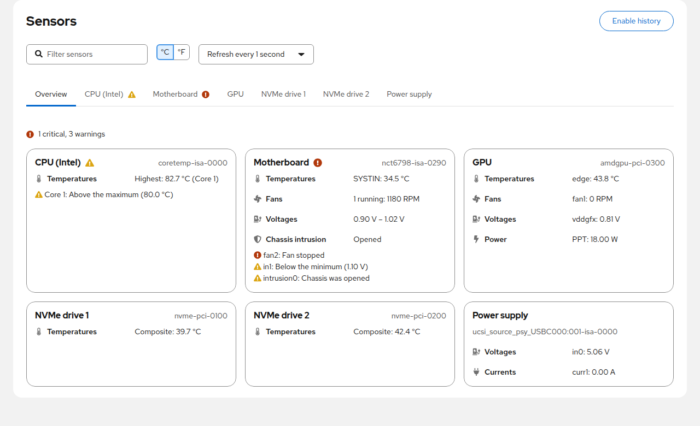

# Cockpit Sensors

A [Cockpit](https://cockpit-project.org/) module that displays all hardware sensor data
reported by [lm-sensors](https://github.com/lm-sensors/lm-sensors): temperatures, fan speeds and voltages.


# Features

- **Overview** of all sensor chips at a glance: hottest temperature, running fans, power draw
  and the sensors that need attention
- One tab per sensor chip, named after its driver (CPU, GPU, NVMe drive, Motherboard, ...),
  grouped into temperatures, fans, voltages, power, currents, energy, humidity and chassis intrusion
- **Alerts**: a status for every sensor (Normal, Warning, Critical) from its limits and the alarm flags of
  the chip, with the reason and the exceeded limit; tabs and Cockpit's menu show when a sensor is in
  trouble, and alerts of a sensor can be ignored (see [Alerts](#alerts))
- Live readings with a sparkline of the last readings and the lowest/highest value since the page
  was opened; refresh every 1, 2, 5 or 10 seconds, paused while the page is not visible
- Filter sensors by name; rename or hide sensors and whole chips (remembered in the browser)
- Sensor history: expand any sensor to see its chart for the last hour, 24 hours or 7 days,
  recorded with [Performance Co-Pilot (PCP)](https://pcp.io/), and export it as CSV
  (see [Sensor history](#sensor-history))
- Celsius or Fahrenheit (applies to all temperature limits; the choice is remembered)
- Works with older lm-sensors versions without JSON output (`sensors -u` fallback)
- Offers to install and configure lm-sensors when it is missing
  (Debian/Ubuntu, Fedora/RHEL/CentOS, openSUSE, Arch, Alpine), and to detect sensors when none is found
- Follows the Cockpit look, including dark mode

# Installation

Packages for every release are attached to the
[latest release](https://github.com/ocristopfer/cockpit-sensors/releases/latest).
They depend on `lm-sensors`; run `sudo sensors-detect` once if `sensors` shows no data.

## Debian / Ubuntu (and derivatives)

From the [APT repository](https://ocristopfer.github.io/cockpit-sensors/), which also delivers updates through `apt upgrade`:

```shell
sudo install -d -m 0755 /etc/apt/keyrings
curl -fsSL https://ocristopfer.github.io/cockpit-sensors/key.gpg | sudo gpg --dearmor -o /etc/apt/keyrings/cockpit-sensors.gpg
echo "deb [signed-by=/etc/apt/keyrings/cockpit-sensors.gpg] https://ocristopfer.github.io/cockpit-sensors stable main" | sudo tee /etc/apt/sources.list.d/cockpit-sensors.list
sudo apt update
sudo apt install cockpit-sensors
```

The repository is signed with the key `4DB9B57CDC03DBE1CD5E7CCD69E7F89677144C1B`.

Or install the package from the release directly:

```shell
wget https://github.com/ocristopfer/cockpit-sensors/releases/latest/download/cockpit-sensors.deb
sudo apt install ./cockpit-sensors.deb
```

## Fedora / RHEL / CentOS Stream

From the [COPR repository](https://copr.fedorainfracloud.org/coprs/ocristopfer/cockpit-sensors/) (x86_64 and aarch64), which also delivers updates:

```shell
sudo dnf copr enable ocristopfer/cockpit-sensors
sudo dnf install cockpit-sensors
```

Or install the RPM from the release directly:

```shell
sudo dnf install https://github.com/ocristopfer/cockpit-sensors/releases/latest/download/cockpit-sensors.noarch.rpm
```

## Any other distribution (manual install)

```shell
wget https://github.com/ocristopfer/cockpit-sensors/releases/latest/download/cockpit-sensors.tar.xz
tar -xf cockpit-sensors.tar.xz cockpit-sensors/dist
sudo rm -rf /usr/share/cockpit/sensors
sudo mkdir -p /usr/share/cockpit/sensors
sudo cp -r cockpit-sensors/dist/. /usr/share/cockpit/sensors/
rm -r cockpit-sensors cockpit-sensors.tar.xz
```

Then reload Cockpit and open **Sensors** in the menu.

# Alerts



Every sensor gets a status, shown in its row (hover it for the reason), on its chip's tab, on the
Overview and next to **Sensors** in Cockpit's menu, also while you are on another Cockpit page:

| Status | When |
|---|---|
| **Critical** | the reading reached the `crit`, `lcrit` or `emergency` limit, a fan with a `min` limit stopped, or the chip raised a critical alarm |
| **Warning** | the reading is above `max` or below `min`, the chip raised another alarm or reports a sensor fault, or the chassis was opened |
| **Normal** | none of the above |

- Limits of `0`, and `min`/`max` pairs where `min` is not below `max` (unused inputs, USB-C sources),
  mean "not set" and are ignored.
- A sensor that went above `max` or `crit` stays in that state until its reading drops below the chip's
  hysteresis (`max_hyst`, `crit_hyst`), so it does not flap around the limit.
- Plain alarm flags only raise a warning: many chips set them for unconnected inputs, and the chassis
  intrusion alarm is often set on boards without an intrusion switch.
- For a false alarm, choose **Ignore alerts** in the sensor's menu: it keeps showing its readings but no
  longer counts in the Overview, the tab icons and Cockpit's menu. **Hide** removes it from view entirely.
  Both are remembered in the browser.
- While the Sensors page is open in the background, sensors are read every 30 seconds to keep Cockpit's
  menu up to date; once you leave Cockpit, nothing is monitored. For notifications while nobody is
  logged in, record the sensors with [PCP](#sensor-history) and use PCP's `pmie`.

# Sensor history


Expand a sensor row to see how its reading changed over the last hour, 24 hours or 7 days,
with the sensor's `max` and `crit` limits and the minimum, average and maximum of the period.
**Export CSV** saves the shown period as a CSV file (time in UTC, value in the displayed unit).

The history is recorded by [Performance Co-Pilot (PCP)](https://pcp.io/), the same service behind
Cockpit's *Metrics and history* page, so it keeps working when the Sensors page is closed.
Click **Enable history** (administrator access required) and the module will:

1. install `pcp` and `python3-pcp` (and `pcp-pmda-lmsensors` on Fedora, RHEL, CentOS and openSUSE), if missing;
2. enable PCP's lm-sensors agent (`pmdalmsensors`), which exports every sensor as `lmsensors.<chip>.<sensor>`;
3. add a `pmlogconf` group so that `pmlogger` records all sensors every minute.

History is kept as long as pmlogger keeps its archives (14 days by default). The recorded
metrics can also be used by other PCP tools, for example `pmval lmsensors.coretemp_isa_0000.core_0`
or Grafana through `pmproxy`.

On other distributions, install PCP and its lm-sensors agent manually and add this group as
`$PCP_VAR_DIR/config/pmlogconf/cockpit-sensors/lmsensors` (fields separated by tabs), then run
`pmlogconf $PCP_VAR_DIR/config/pmlogger/config.default` and restart `pmlogger`:

```
#pmlogconf-setup 2.0
ident	lm-sensors readings (temperatures, fans, voltages) for Cockpit Sensors
force	include
delta	1 minute
	lmsensors
```

# Development

```shell
make pkg/lib/cockpit-po-plugin.js   # fetch Cockpit's pkg/lib once
npm install
npm run build                       # or: make watch
npm run eslint && npm run stylelint && npx tsc --noEmit
npm run test:unit                   # unit tests (QUnit) of the parsing, formatting and status logic
make check                          # integration tests in a Cockpit test VM
```

# Releasing

Releases are built and published by the [release workflow](.github/workflows/release.yml):

- push a version tag: `git tag -a 2.0.0 -m 2.0.0 && git push origin 2.0.0`, or
- run the **release** workflow from the Actions tab and type the version; it creates the tag.

The workflow builds the tarball, the `.deb` and the `.rpm`, creates the GitHub release with
generated release notes and adds the `.deb` to the APT repository on GitHub Pages
([apt-repo workflow](.github/workflows/apt-repo.yml), signed with the `APT_GPG_PRIVATE_KEY` secret).
Publishing the release also makes Packit build it in the
[COPR repository](https://copr.fedorainfracloud.org/coprs/ocristopfer/cockpit-sensors/).

# Contributors

Thanks to everyone who helped build this module:

- [@ocristopfer](https://github.com/ocristopfer) — author and maintainer
- [@RampantDespair](https://github.com/RampantDespair) — designed and wrote the new 2.0 user interface (#102)
- [@barrotsteindev](https://github.com/barrotsteindev) — rebased and finished the 2.0 interface (#108), PatternFly 6 migration, translations and packaging fixes
- [@subz390](https://github.com/subz390) — original installation script
- Everyone who reported issues and tested releases

# Module created using Starter Kit

# Cockpit Starter Kit

Scaffolding for a [Cockpit](https://cockpit-project.org/) module.

# Development dependencies

On Debian/Ubuntu:

    sudo apt install gettext nodejs npm make

On Fedora:

    sudo dnf install gettext nodejs npm make

On openSUSE Tumbleweed and Leap:

    sudo zypper in gettext-runtime nodejs npm make

# Getting and building the source

These commands check out the source and build it into the `dist/` directory:

```
git clone https://github.com/cockpit-project/starter-kit.git
cd starter-kit
make
```

# Installing

`make install` compiles and installs the package in `/usr/local/share/cockpit/`. The
convenience targets `srpm` and `rpm` build the source and binary rpms,
respectively. Both of these make use of the `dist` target, which is used
to generate the distribution tarball. In `production` mode, source files are
automatically minified and compressed. Set `NODE_ENV=production` if you want to
duplicate this behavior.

For development, you usually want to run your module straight out of the git
tree. To do that, run `make devel-install`, which links your checkout to the
location were cockpit-bridge looks for packages. If you prefer to do
this manually:

```
mkdir -p ~/.local/share/cockpit
ln -s `pwd`/dist ~/.local/share/cockpit/starter-kit
```

After changing the code and running `make` again, reload the Cockpit page in
your browser.

You can also use
[watch mode](https://esbuild.github.io/api/#watch) to
automatically update the bundle on every code change with

    ./build.js -w

or

    make watch

When developing against a virtual machine, watch mode can also automatically upload
the code changes by setting the `RSYNC` environment variable to
the remote hostname.

    RSYNC=c make watch

When developing against a remote host as a normal user, `RSYNC_DEVEL` can be
set to upload code changes to `~/.local/share/cockpit/` instead of
`/usr/local`.

    RSYNC_DEVEL=example.com make watch

To "uninstall" the locally installed version, run `make devel-uninstall`, or
remove manually the symlink:

    rm ~/.local/share/cockpit/starter-kit

# Running eslint

Cockpit Starter Kit uses [ESLint](https://eslint.org/) to automatically check
JavaScript/TypeScript code style in `.js[x]` and `.ts[x]` files.

eslint is executed as part of `test/static-code`, aka. `make codecheck`.

For developer convenience, the ESLint can be started explicitly by:

    npm run eslint

Violations of some rules can be fixed automatically by:

    npm run eslint:fix

Rules configuration can be found in the `.eslintrc.json` file.

## Running stylelint

Cockpit uses [Stylelint](https://stylelint.io/) to automatically check CSS code
style in `.css` and `scss` files.

styleint is executed as part of `test/static-code`, aka. `make codecheck`.

For developer convenience, the Stylelint can be started explicitly by:

    npm run stylelint

Violations of some rules can be fixed automatically by:

    npm run stylelint:fix

Rules configuration can be found in the `.stylelintrc.json` file.

# Running tests locally

Run `make check` to build an RPM, install it into a standard Cockpit test VM
(centos-9-stream by default), and run the test/check-application integration test on
it. This uses Cockpit's Chrome DevTools Protocol based browser tests, through a
Python API abstraction. Note that this API is not guaranteed to be stable, so
if you run into failures and don't want to adjust tests, consider checking out
Cockpit's test/common from a tag instead of main (see the `test/common`
target in `Makefile`).

After the test VM is prepared, you can manually run the test without rebuilding
the VM, possibly with extra options for tracing and halting on test failures
(for interactive debugging):

    TEST_OS=centos-9-stream test/check-application -tvs

It is possible to setup the test environment without running the tests:

    TEST_OS=centos-9-stream make prepare-check

You can also run the test against a different Cockpit image, for example:

    TEST_OS=fedora-40 make check

# Running tests in CI

These tests can be run in [Cirrus CI](https://cirrus-ci.org/), on their free
[Linux Containers](https://cirrus-ci.org/guide/linux/) environment which
explicitly supports `/dev/kvm`. Please see [Quick
Start](https://cirrus-ci.org/guide/quick-start/) how to set up Cirrus CI for
your project after forking from starter-kit.

The included [.cirrus.yml](./.cirrus.yml) runs the integration tests for two
operating systems (Fedora and CentOS 8). Note that if/once your project grows
bigger, or gets frequent changes, you may need to move to a paid account, or
different infrastructure with more capacity.

Tests also run in [Packit](https://packit.dev/) for all currently supported
Fedora releases; see the [packit.yaml](./packit.yaml) control file. You need to
[enable Packit-as-a-service](https://packit.dev/docs/packit-service/) in your GitHub project to use this.
To run the tests in the exact same way for upstream pull requests and for
[Fedora package update gating](https://docs.fedoraproject.org/en-US/ci/), the
tests are wrapped in the [FMF metadata format](https://github.com/teemtee/fmf)
for using with the [tmt test management tool](https://docs.fedoraproject.org/en-US/ci/tmt/).
Note that Packit tests can _not_ run their own virtual machine images, thus
they only run [@nondestructive tests](https://github.com/cockpit-project/cockpit/blob/main/test/common/testlib.py).

# Customizing

After cloning the Starter Kit you should rename the files, package names, and
labels to your own project's name. Use these commands to find out what to
change:

    find -iname '*starter*'
    git grep -i starter

# Automated release

Once your cloned project is ready for a release, you should consider automating
that. The intention is that the only manual step for releasing a project is to create
a signed tag for the version number, which includes a summary of the noteworthy
changes:

```
123

- this new feature
- fix bug #123
```

Pushing the release tag triggers the [release.yml](.github/workflows/release.yml.disabled)
[GitHub action](https://github.com/features/actions) workflow. This creates the
official release tarball and publishes as upstream release to GitHub. The
workflow is disabled by default -- to use it, edit the file as per the comment
at the top, and rename it to just `*.yml`.

The Fedora and COPR releases are done with [Packit](https://packit.dev/),
see the [packit.yaml](./packit.yaml) control file.

# Automated maintenance

It is important to keep your [NPM modules](./package.json) up to date, to keep
up with security updates and bug fixes. This happens with
[dependabot](https://github.com/dependabot),
see [configuration file](.github/dependabot.yml).

# Further reading

- The [Starter Kit announcement](https://cockpit-project.org/blog/cockpit-starter-kit.html)
  blog post explains the rationale for this project.
- [Cockpit Deployment and Developer documentation](https://cockpit-project.org/guide/latest/)
- [Make your project easily discoverable](https://cockpit-project.org/blog/making-a-cockpit-application.html)
